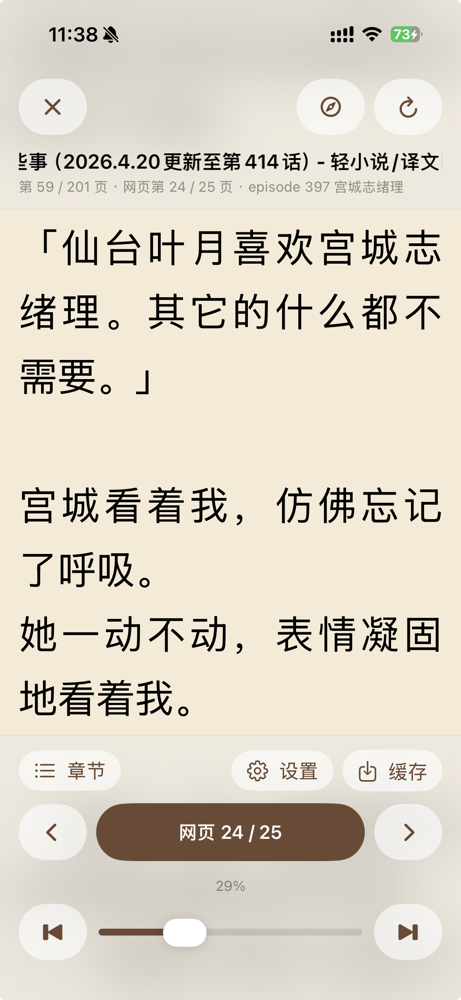
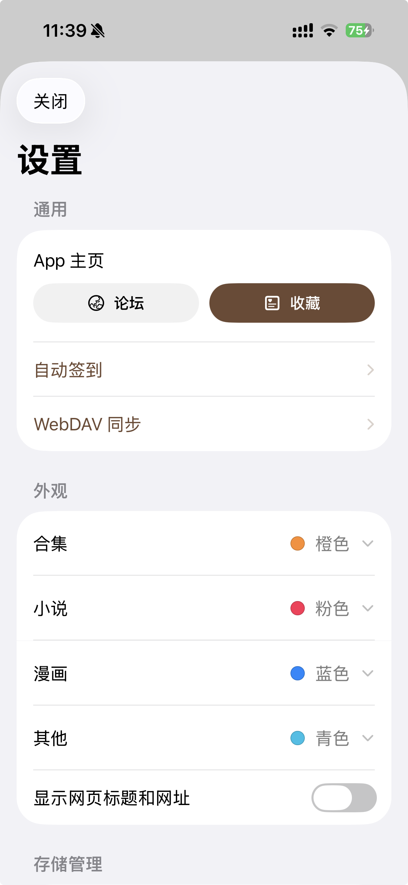
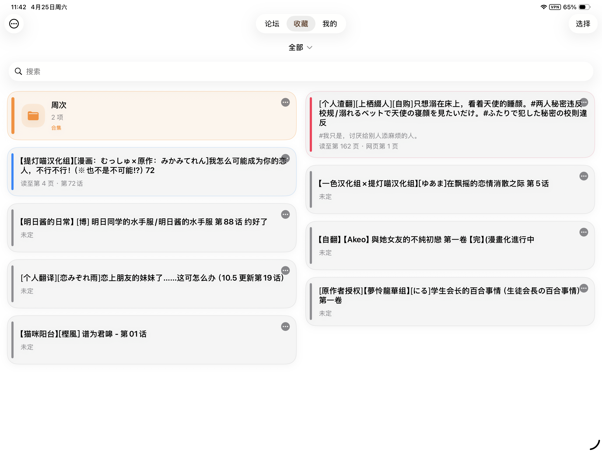
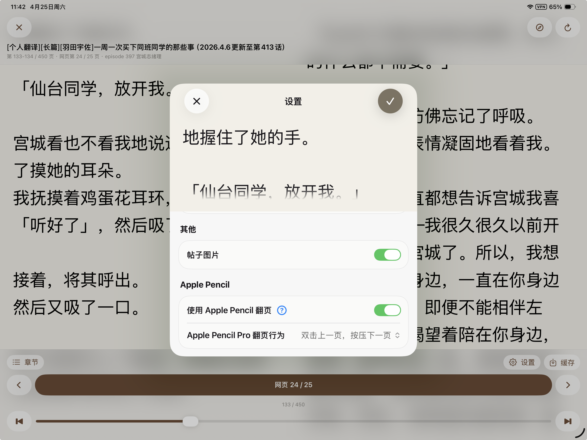

# YamiboReader Swift

`YamiboReader Swift` 是一个面向百合会内容的小说 / 漫画阅读器 SwiftUI 实现。项目包含可复用的核心解析与数据层、SwiftUI 界面层，以及一个独立 iOS App 入口。

## 界面预览

<p align="center">
  
  
  
  
  <br />
  
  
</p>

## 功能概览

### 论坛浏览

- 基于 `WebKit` 提供百合会移动版论坛浏览入口
- 支持论坛历史、原帖打开、刷新与外部浏览器跳转
- 支持从论坛页面识别并进入小说或漫画阅读流程
- 提供“论坛 / 收藏 / 我的”三标签主界面，并可配置默认启动页

### 收藏管理

- 支持拉取并展示百合会收藏页内容
- 支持本地收藏库、合集分组、手动排序、筛选、搜索与批量选择
- 支持编辑显示名、隐藏 / 取消隐藏、移动合集、分享与删除收藏
- 支持收藏外观分类配色和漫画目录缓存管理

### 小说阅读

- 提供阅读内容抓取、HTML 解析与正文清洗能力
- 支持章节标题归一化、网页页码跳转、章节切换和阅读进度保存
- 支持分页与纵向两种阅读模式
- 支持字体、字号、行距、字距、页边距、背景、简繁转换、两页横屏显示等阅读设置
- 支持阅读缓存、缓存更新、缓存删除和后台缓存任务
- 支持内联图片加载和 iPad Apple Pencil 翻页设置

### 漫画阅读

- 支持漫画目录、章节、页面与图片地址解析
- 提供原生漫画阅读器，支持分页 / 纵向阅读切换
- 支持目录跳转、章节排序、章节名修正、阅读进度保存与图片缓存
- 在无法顺利进入原生阅读时，可回退到网页漫画视图

### 登录、同步与本地能力

- 支持会话状态、Cookie / UA 等访问上下文的持久化管理
- 提供百合会每日签到能力，并包含 App Shortcuts / 快捷指令入口
- 支持通过 WebDAV 上传或下载本地收藏、阅读进度和设置快照
- 支持阅读缓存、漫画图片缓存、目录缓存与设置存储
- 提供应用数据重置、小说缓存清理、漫画缓存清理与本地 Web 数据清理能力

## 运行与验证

### 环境要求

- Swift 6.0+
- iOS 17+
- macOS 14+（Swift Package 目标支持）
- Xcode 15+ 或更新版本

### Swift Package

仓库通过 [`Package.swift`](Package.swift) 定义核心模块：

- `YamiboReaderCore`：数据模型、网络访问、HTML 解析、缓存、同步与本地存储
- `YamiboReaderUI`：SwiftUI 界面、论坛容器、收藏页、小说阅读器与漫画阅读器

依赖：

- [`SwiftSoup`](https://github.com/scinfu/SwiftSoup)

在仓库根目录执行测试：

```bash
swift test
```

### iOS App

iOS App 入口位于 [`YamiboReader/YamiboReaderApp.swift`](YamiboReader/YamiboReaderApp.swift)，对应的 Xcode 工程位于 [`YamiboReader.xcodeproj`](YamiboReader.xcodeproj)。

如果需要在模拟器或真机中运行，使用 Xcode 打开工程并构建 `YamiboReader` App target。

## 项目结构

- [`Sources/YamiboReaderCore`](Sources/YamiboReaderCore)：核心模型、网络访问、解析、同步、缓存与存储
- [`Sources/YamiboReaderUI`](Sources/YamiboReaderUI)：SwiftUI 界面、论坛 Web 容器、阅读器和收藏管理
- [`YamiboReader`](YamiboReader)：独立 iOS App 入口、资源和系统集成能力
- [`Tests/YamiboReaderCoreTests`](Tests/YamiboReaderCoreTests)：核心解析、缓存、存储、签到与 WebDAV 同步测试
- [`Tests/YamiboReaderUITests`](Tests/YamiboReaderUITests)：界面模型、路由、阅读器状态和漫画流程测试

## TODO

- [x] 多设备阅读进度同步
- [x] 更完善的 iPad 支持
- [ ] 章节评论查看
- [ ] 多账号管理
- [ ] 更新检查
- [ ] 更新推送

## 为什么要做本项目？

~~因为我自己要看~~

## 特别感谢

- [prprbell/YamiboReaderPro](https://github.com/prprbell/YamiboReaderPro)
- [flben233/YamiboReader](https://github.com/flben233/YamiboReader)
- [scinfu/SwiftSoup](https://github.com/scinfu/SwiftSoup)

## License

本项目采用 `GNU Affero General Public License v3.0` (`AGPL-3.0`) 许可发布。详见 [`LICENSE`](LICENSE)。
